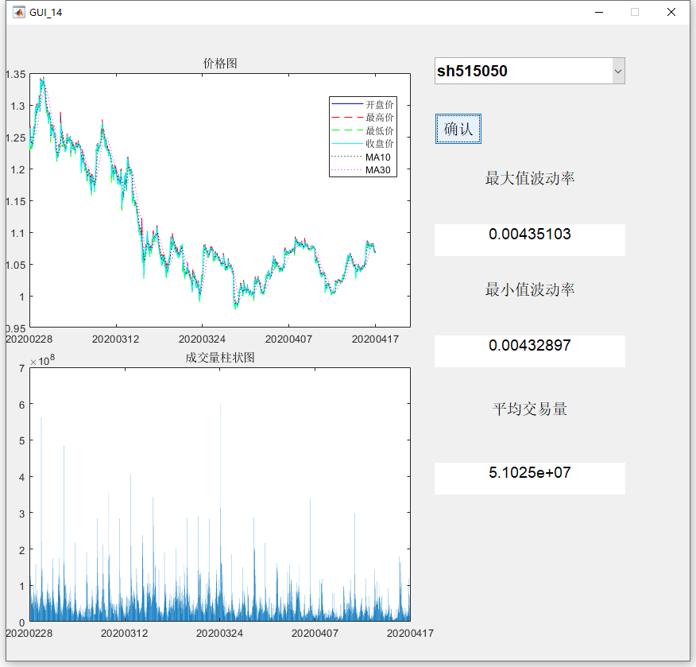

# stockGUI
A simple GUI demonstrating how to use MATLAB GUI to show basic stock price informations.

## How to run this program
In matlab, run the following scripts to see the GUI: `stock_gui.m`.

A screenshot:
